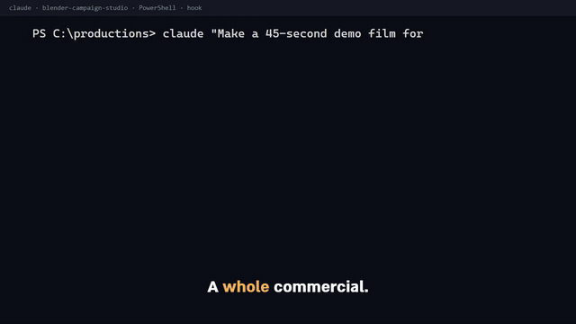
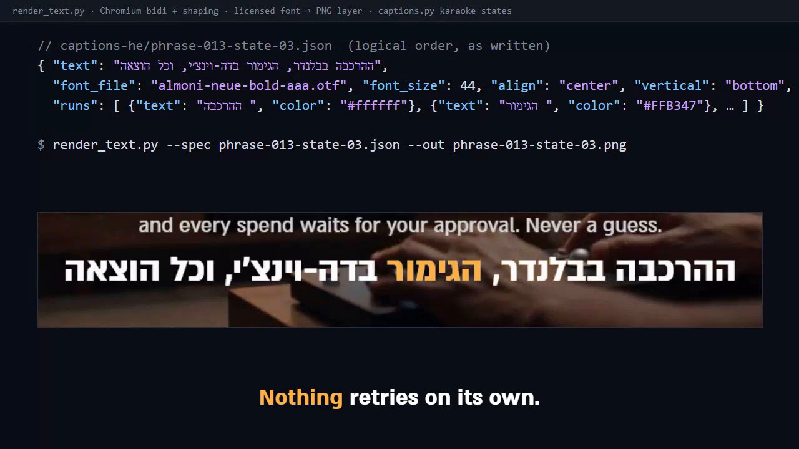
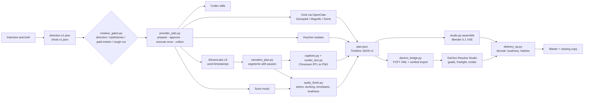

# Blender Campaign Studio

**An agent skill that runs a commercial production as a pipeline with contracts: brief, shots, narration, music, right-to-left typography, Blender assembly, DaVinci Resolve finishing, QA.** For Claude Code and Codex CLI.

[](https://github.com/Meir770ar/blender-campaign-studio/actions/workflows/tests.yml)
[](LICENSE)
[](requirements.txt)
[](https://www.blender.org/)
[](references/davinci-resolve.md)

Every paid generation is a ledger entry with a recorded approval and a cap. Nothing retries on its own. Hebrew is rendered, never typed into an NLE. A human watches and listens before anything is called done.

> Built for Hebrew commercials. The typography path (Chromium bidi and shaping to PNG layers) should serve other right-to-left languages such as Arabic and Persian; only Hebrew has been verified.

## Demo



The film is a 32-second developer cut, assembled by the skill from its own plan (`studio.py validate`, `studio.py assemble --render`, `delivery_qa.py`). The Blender and DaVinci Resolve screens are real captures of the pipeline running, and the caption line below is what the typography path produces: a licensed Hebrew font shaped by Chromium into a PNG layer with the spoken word in amber, never typed into an NLE.



## Pipeline



## What runs locally, what needs an account

The core is local and free. Integrations add capabilities; each one is a route in `connections.json` that the skill probes before use and skips when absent.

| Layer | You need | You get |
|---|---|---|
| **Local core** | Windows 11, Python 3.11+ (`playwright`, `fontTools`), Node 20+, FFmpeg, Blender 5.1.0, one licensed Hebrew font | Contracts and gates, timeline assembly in the Blender VSE (motion presets, keyframes, image sequences with alpha, freeze frames), RTL typography and captions from any word-timing file, sound finishing (stems, ducking, gain envelopes, two-pass loudness), Foley and edit audits, product/compositing techniques in Blender, delivery QA, compressed viewing copies |
| **Narration** | ElevenLabs account (v3 voice) | One request for the whole script, word timestamps, directed pauses cut from the single render, captions synced to speech |
| **Music** | Suno account, or your own licensed library | Original instrumental, clip extension for a planned change of character, library picks by mood |
| **Generated shots** | One of: Genspark (Grok Imagine on Genspark credits), Grok through an OpenClaw gateway, Magnific, Dzine | Text-to-video and first-frame-to-video shots under batch approvals with a pilot and a shared cap |
| **Presenter** | HeyGen account | Avatar IV/V shots with a versioned character library |
| **Stills** | ChatGPT with Codex CLI | Character sheets and per-shot stills (the still step runs in Codex) |
| **Script and vision QA** | Google AI Pro (Antigravity client) | Story-first script drafts, semantic shot/master analysis, closed-question checks of each generated shot against its exclusion list |
| **Finishing** | DaVinci Resolve Studio 21.1 (scripting is Studio-only) + its MCP server | FCP7 XML hand-off with a verified import, grading, Fairlight, delivery renders; Blender finishes the film when Resolve is absent |
| **Kinetic titles** | Tesseract (`tsrct`) on an NVIDIA GPU | Editable Hebrew motion titles exported with alpha |
| **GPU station** | A second Windows machine over SSH | Remote Cycles renders, a verified production archive, Resolve finishing on the faster GPU |
| **Footage transcription** | A local Whisper / ivrit.ai stack | Word timings for editing from raw footage |
| **Delivery** | A WAHA host and your own WhatsApp number | The final viewing copy sent to yourself with a receipt ledger |

Not included: the user-side clients the skill drives (`suno-cli`, `heygen-cli`, `@genspark/cli`, `agy-cloudcode.mjs`, the Magnific/Dzine clients, the OpenClaw runtime). Point `connections.json` at your own installations; it holds locations and model names, never credentials.

## The ledger: how spending is controlled

```powershell
python scripts/provider_jobs.py prepare --request shot-S04.json --jobs PROJECT/jobs        # semantic job id from the exact request
python scripts/provider_jobs.py approve-batch --jobs PROJECT/jobs --job ID1 --job ID2 ... `
    --evidence "user approved 8 shots, up to 4600 credits" --limit 4600 --unit "genspark credits" --per-job 900 --pilot 2
python scripts/provider_jobs.py execute --job PROJECT/jobs/ID1 --estimated-usage 460            # refused past the cap or outside the pilot
python scripts/provider_jobs.py batch-release --jobs PROJECT/jobs --batch BATCH --evidence "pilot reviewed: ..."
python scripts/provider_jobs.py collect-genspark --job PROJECT/jobs/ID1                         # downloads only what the receipt names
```

- A job is identified by the content of its request (prompt, settings, reference image bytes). Moving a file does not create a new attempt.
- `execute` runs once. A crash after submission leaves the job `unknown`; the next step is reconciliation against the provider's own receipt, never a resubmission.
- The batch ledger holds a lock while it checks the running total; a pilot holds the remaining jobs until a review is recorded.
- Style rules travel as positive `style_constraints` (up to 12) and at most three `avoid` items folded into every prompt of a series; `antigravity.py check` asks closed yes/no questions about each collected shot.

## A timeline is data

`plan.json` (Timeline JSON v1) is what both `studio.py assemble` (Blender) and `davinci_bridge.py export-xml` (Resolve) consume:

```json
{
  "version": 1, "width": 1920, "height": 1080, "fps": 24, "frames": 1152,
  "audio_target_lufs": -16, "audio_true_peak_max": -1.5,
  "clips": [
    {"id": "S01", "kind": "movie", "path": "shots/S01.mp4", "start": 1, "duration": 120, "channel": 1,
     "fade_in": 12, "motion": "zoom-in", "motion_amount": 0.05},
    {"id": "S01-freeze", "kind": "image", "path": "assets/S01-last-frame.png", "start": 121, "duration": 48, "channel": 1},
    {"id": "caption-1", "kind": "image", "path": "captions/phrase-001-state-01.png", "start": 20, "duration": 46, "channel": 10,
     "text_source": "captions/phrase-001-state-01.json"},
    {"id": "logo", "kind": "image-sequence", "path": "assets/logo-seq/frame_00001.png", "start": 1080, "duration": 72, "channel": 6,
     "hold_last": true, "resolve_movie": "assets/logo-resolve.mov", "fade_in": 6},
    {"id": "mix", "kind": "sound", "path": "audio-v001/master.wav", "start": 1, "duration": 1152, "channel": 20}
  ]
}
```

`studio.py validate` checks every file, trim, overlap, frame rate and envelope before anything renders, and warns when a small source is enlarged by a motion preset or when too many strips move.

## Quick start

```powershell
git clone https://github.com/Meir770ar/blender-campaign-studio.git "$env:USERPROFILE\.codex\skills\blender-campaign-studio"
New-Item -ItemType Junction -Path "$env:USERPROFILE\.claude\skills\blender-campaign-studio" -Target "$env:USERPROFILE\.codex\skills\blender-campaign-studio"
cd "$env:USERPROFILE\.codex\skills\blender-campaign-studio"
pip install -r requirements.txt
playwright install chromium
Copy-Item connections.example.json connections.json      # edit the routes you actually have
python scripts/studio.py doctor
```

A first production, end to end:

```powershell
python scripts/studio.py init --project <productions>/my-film --idea "the idea in the user's words"
Copy-Item templates/direction-v1.json <productions>/my-film/planning/direction-v1.json     # replace every REPLACE: field
Copy-Item templates/shots-v1.json     <productions>/my-film/planning/shots-v1.json
python scripts/creative_gates.py --direction <productions>/my-film/planning/direction-v1.json --stage direction --out <productions>/my-film/planning/direction-gate-v001.json

Copy-Item templates/narration-v1.template.json <productions>/my-film/planning/narration-v1.json
python scripts/narration_plan.py split  --script <productions>/my-film/planning/narration-v1.json --out-dir <productions>/my-film/narration/requests-v001
# render request-single.json through provider_jobs.py (prepare / approve / execute), then:
python scripts/narration_plan.py layout --mode single --script <productions>/my-film/planning/narration-v1.json --jobs <productions>/my-film/jobs --out-dir <productions>/my-film/narration/layout-v001

python scripts/captions.py     --words <productions>/my-film/narration/layout-v001/words.json --style caption-style.json --out-dir <productions>/my-film/captions-v001 --fps 24
python scripts/audio_finish.py --spec <productions>/my-film/mix-v001.json --out-dir <productions>/my-film/audio-v001
python scripts/studio.py validate --plan <productions>/my-film/plan-v001.json
python scripts/studio.py assemble --plan <productions>/my-film/plan-v001.json --out-dir <productions>/my-film/render-v001 --render
python scripts/delivery_qa.py --video <productions>/my-film/render-v001/preview.mp4 --plan <productions>/my-film/plan-v001.json --audio-qa <productions>/my-film/audio-v001/qa.json --out <productions>/my-film/delivery-qa-v001.json
```

In Claude Code or Codex, a Hebrew request such as "בוא נכין סרטון לעסק שלי" activates the skill; `SKILL.md` is the doctrine the agent follows and `references/long-form-commercial.md` is a complete recipe for a 150-second commercial.

## Status

Used daily by the author on Windows 11. 222 Python and 10 Node unit tests run in CI on Windows; they mock every provider and never render. Live capabilities of external services change: run the `probe` commands before a production and read the dated verification records in `references/verification.md` before trusting a documented limit.

## Repository layout

| Path | Contents |
|---|---|
| `SKILL.md` | The skill entry point (Hebrew): doctrine, workflow, which reference to read when |
| `references/` | Contracts and guides: providers, editorial, sound, Hebrew typography, Resolve, render station, verification records |
| `scripts/` | The pipeline (Python 3.11, a few Node bridges) and its unit tests |
| `templates/` | JSON contracts to copy into a production: direction, shots, narration, mix, character sheet, techniques |
| `connections.example.json` | Every route the skill can use, with placeholders |
| `_verification/20260909-provider-expansion/` | The OpenClaw xAI video-provider patch package applied by `activate_grok_patch.py`; see `THIRD_PARTY_NOTICES.md` |

## Testing

```powershell
python -m unittest discover -s scripts -p "test_*.py"
node --test scripts/test_grok_activation.mjs scripts/test_grok_native.mjs
ruff check scripts
```

`scripts/verify_local.py` exercises the real FFmpeg, Chromium and Blender paths on synthetic media.

## Contributing, security, license

[CONTRIBUTING.md](CONTRIBUTING.md) for the development rules, [SECURITY.md](SECURITY.md) for reporting a vulnerability. MIT, see [LICENSE](LICENSE); third-party code is listed in [THIRD_PARTY_NOTICES.md](THIRD_PARTY_NOTICES.md).

## תקציר בעברית

סקיל להפקת פרסומות וסרטוני תדמית בעברית מקצה לקצה: ראיון ובריף, בימוי וחוזי שוטים, קריינות עם השהיות מבוימות, מוזיקה וסאונד, כתוביות RTL בצבעי מותג, הרכבה ב-Blender 5.1, גימור ב-DaVinci Resolve Studio, בדיקות ומסירה. הליבה רצה מקומית בלי מנויים; כל ספק הוא מסלול אופציונלי. כל הוצאה בתשלום דורשת אישור רשום, אין ניסיונות חוזרים אוטומטיים, וכל שוט נצפה ונשמע לפני שהוא מוכרז גמור.
